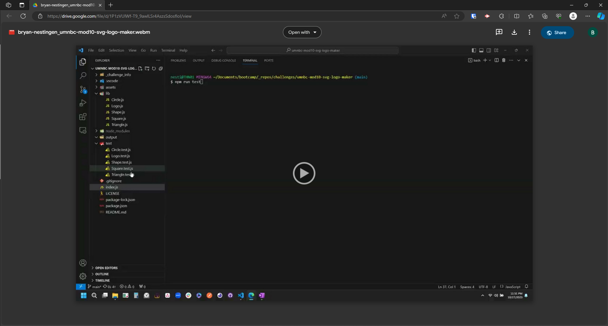

# SVG Logo Maker
*University of Minnesota - Coding Boot Camp - Module 09 Node.js Challenge*


## Description

A Node.js command-line application that takes in user input to generate a logo and save it as an SVG file. The application prompts the user to select a color and shape, provide text for the logo, and save the generated SVG to a .svg file.

## Table of Contents

- [Usage](#usage)
- [Installation](#installation)
- [Tests](#tests)
- [Contributing](#contributing)
- [Questions](#questions)
- [License](#license)

## Usage

#### Click the link to view the [Demo Video](https://drive.google.com/file/d/1sFGa3iuThBwFbmOwFyWgOm3I67zAdO6v/view).


#### Files: 

- index.js
- package.json
- README.md
- ./ouptput/logo.svg
- Libraries (./lib/)
    - Circle.js
    - Logo.js
    - Shape.js
    - Square.js
    - Triangle.js

#### Invoking the application
1. Install Node.js locally
2. Clone or Fork the Repo
3. Open Repo Directory in VS Code Integrated Terminal (or Git Bash)
4. Execute `node index.js` in a bash command-line
5. Answer the command-line prompts.
6. Open the file `./output/logo.svg` to view the SVG file generated from the prompts 

## Installation

Execute the following in a bash command-line to install dependencies:
```
npm install 
npm i inquirer@8.2.4
```


## Tests

Execute the following in a bash command-line to run tests:
```
npm run test
```

## Contributing

- Please send an email to the code owner before contributing; see the questions section for contact information. 
- Please follow the [Contributor Covenant](https://www.contributor-covenant.org/) when contributing.

## Questions

- GitHub Profile: [nestibry](https://github.com/nestibry)
- Please email me at [nestibry@gmail.com](mailto:nestibry@gmail.com) with any questions

## Credits
- © 2023 edX Boot Camps LLC.

## License

- The content of this application is licensed under the [MIT License](https://choosealicense.com/licenses/mit/)

